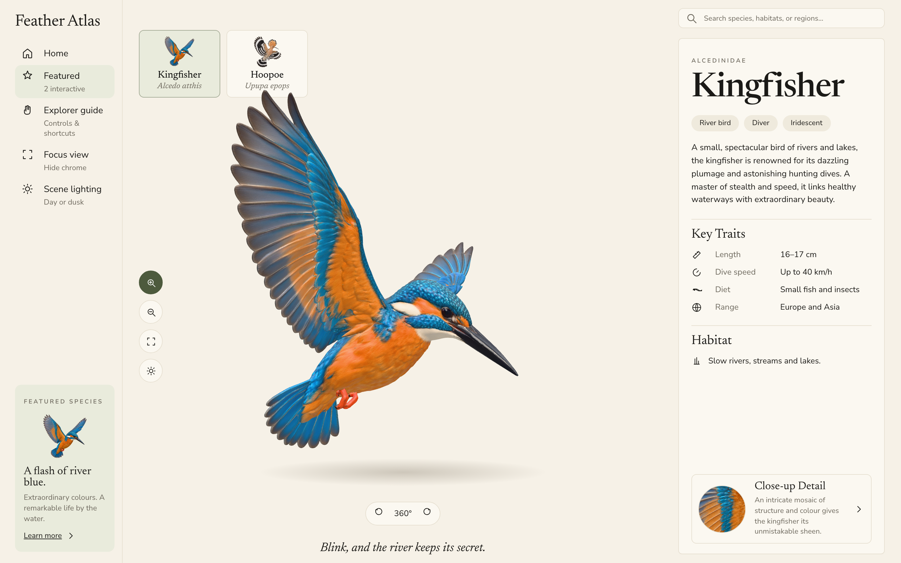
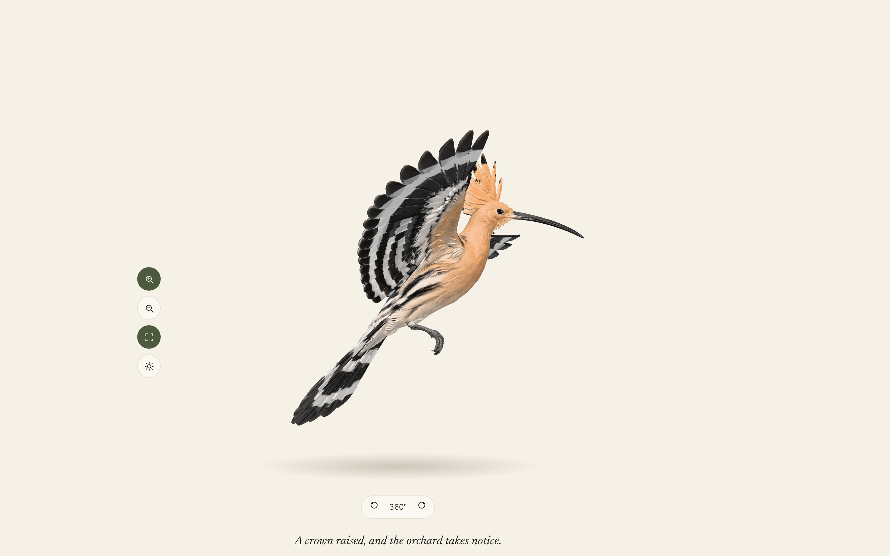
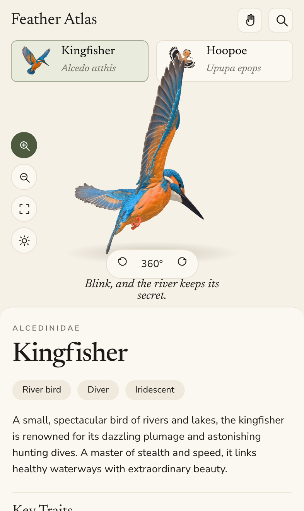
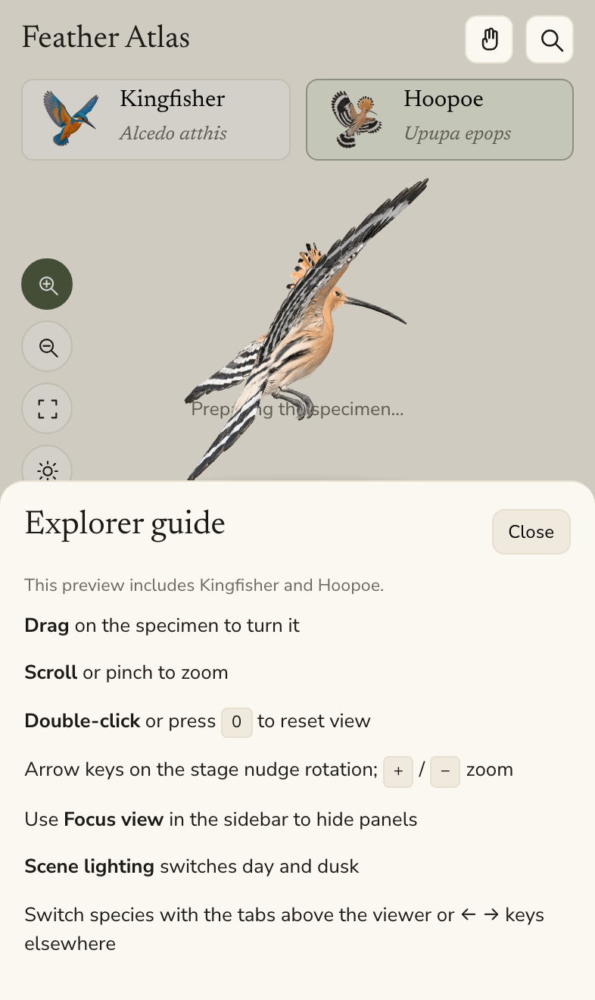

# Feather Atlas

**Feather Atlas** is an interactive field guide that pairs rich species copy with **3D specimens** you can turn, zoom, and study up close. It is a design-forward preview of how a digital atlas could feel: calm typography, a small reusable UI kit, and a hero viewer built for touch and desktop.

**Live demo:** [https://feather-atlas.web.app](https://feather-atlas.web.app)

## What you can do

- **Explore two featured species** — **Kingfisher** (*Alcedo atthis*) and **Hoopoe** (*Upupa epops*) — via tabs above the viewer.
- **Interact with GLB models** — drag to orbit, scroll or pinch to zoom, double-click (or press `0`) to reset. Rails offer zoom, focus, and lighting; rotation shortcuts appear on larger layouts.
- **Read field-guide detail** — family, tags, key traits, habitat, and a close-up detail panel.

Specimen images and models load from CloudFront URLs in `src/app/data/asset-urls.ts` (not bundled in the repo).

### Desktop

Sidebar actions include **Home** (reset), **Featured** (focus the stage), **Explorer guide**, **Focus view** (hide chrome), and **Scene lighting** (day / dusk). Traits and habitat sit in the panel on the right.



**Focus view** drops the sidebar and detail panel so the specimen fills the hero:



### Mobile

Species tabs and a scrollable detail sheet below the viewer. **Focus view** also hides the top bar, tabs, bottom caption, and 360° pill; the left rail stays so you can zoom and exit focus.



Open **Explorer guide** from the hand icon in the top bar for controls and shortcuts:



## Stack

- [Angular](https://angular.dev/) 22.2 (standalone components, signals)
- [Three.js](https://threejs.org/) via CDN import map in `src/index.html`
- Hosting: [Firebase Hosting](https://firebase.google.com/docs/hosting)

## Run locally

```bash
npm install
npm start
```

Open [http://localhost:4200/](http://localhost:4200/).

## Deploy

```bash
npm run deploy
```

Build output is `dist/feather-atlas/browser`. Firebase project id: `feather-atlas` (see `.firebaserc`).

## Design system

- Design tokens: `src/styles/_tokens.scss`
- Shared UI primitives: `src/app/design-system/`

## Media (optional)

Regenerate demo assets (dev server running):

```bash
node scripts/capture-screenshots.mjs http://127.0.0.1:4200/
node scripts/record-mobile-demo.mjs http://127.0.0.1:4200/
```

Outputs land in `docs/screenshots/` and `docs/feather-atlas-mobile-demo.mp4` (requires Playwright; MP4 uses `ffmpeg-static`).
